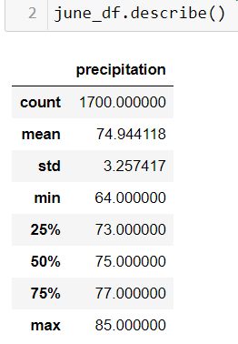
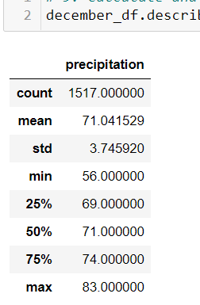

# surfs_up

## Purpose

### Overview of the Analysis
- The purpose of the analysis was to determine whether a surf and ice cream shop would be a viable business for the months of June and December. The analysis was performed by data gathered with W.Avy, with all of the temperature data for Oahu. The procedure of the analysis involved using python, Pandas, and SQLAlchemy. Temperature data for June and December was retrieved by using the session.query() method with a SQLite database. 

## Results
The following are the results for June and December's weather

- The difference between June and December's temperature averages is only 4 degrees, and the maximum and minimum temperatures are all relatively close in comparison. With the overall maximum temperature of 85 degrees and June and overall minimum temperature of 56 degrees in December, it can be concluded that the ice cream shop year round could be a viable business. 

## Summary

- After retrieving and analyzing the gathered data, it appears that the year round weather in Oahu would have a minimal affect on opening an ice cream shop. However, the following points are made based on the findings:
1. The location of the weather stations that are responsible in the production of the data used in the analysis could be an important factor in the legitimacy of the analysis. The weather pattern in the Hawaii islands chain changes extremely rapidly, so the frequency of the data collected at the weather stations could determine the accuracy of the data. 
2. A separate analysis can be performed by analyzing the number of opened ice cream shops in the area. This could give us a better accuracy in determining the viability of the ice cream business in Oahu. 
3. The precipitation count in June was about 10% higher than December, which means the weather pattern in June changes more rapidly in June. A separate analysis can also be performed to closely inspect precipitation levels around the month of June. As previously mentioned, Hawaii's weather changes very quickly, and combining this separate analysis with the ice cream shop analysis mentioned previously could give us a much more accurate conclusion in the viability of the business. 
